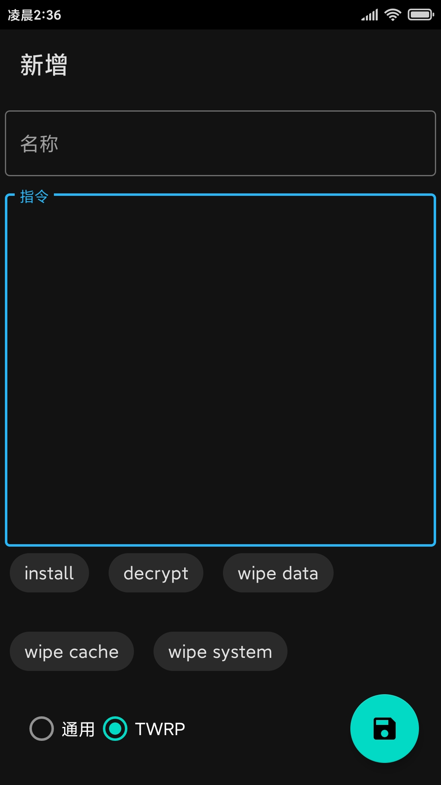
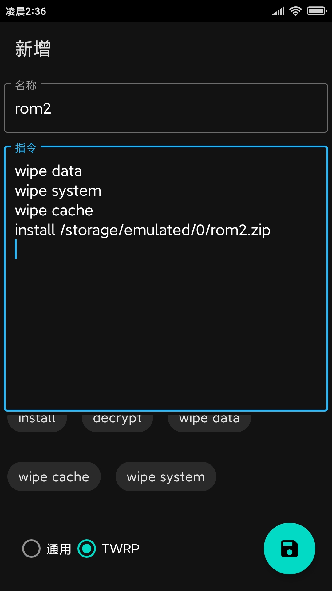
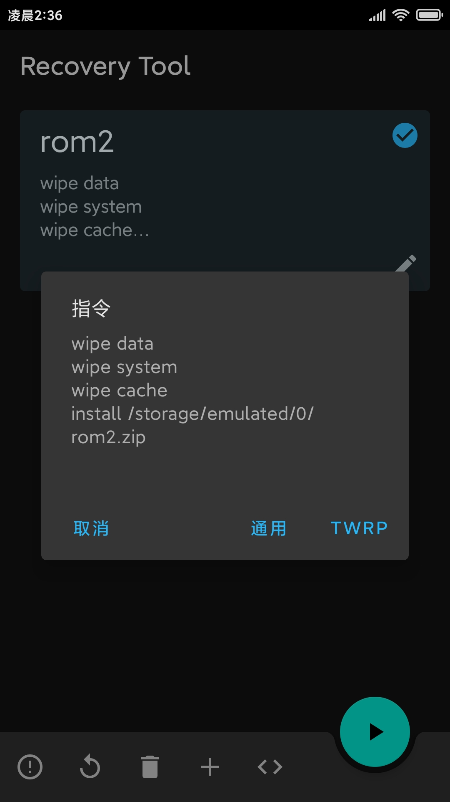
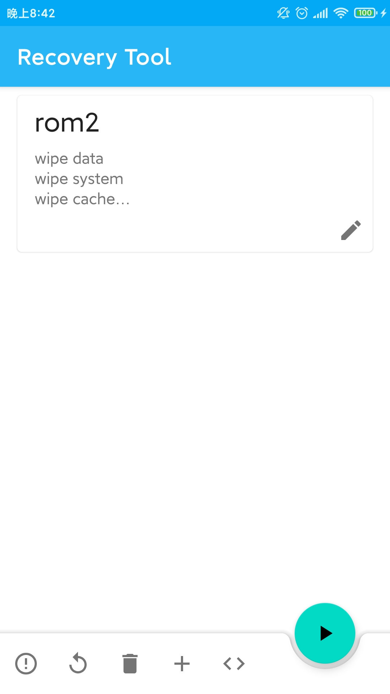
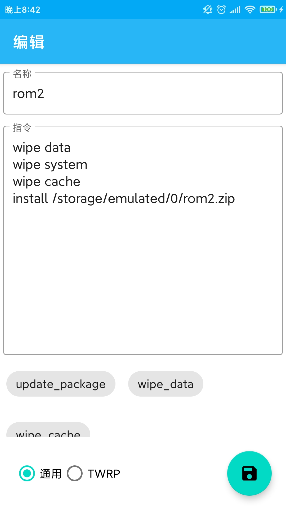
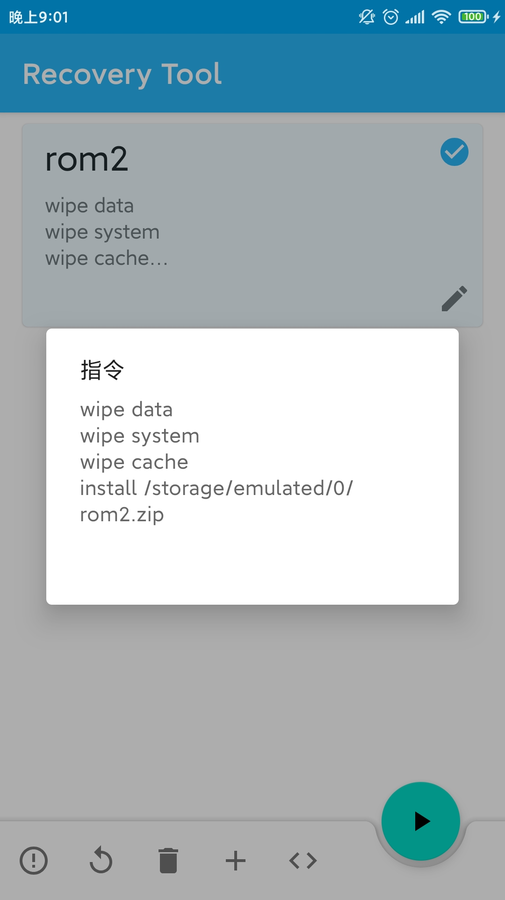

写入/cache/recovery/路径上的脚本文件 达到自动运行Recovery的效果

参考指令

https://twrp.me/faq/openrecoveryscript.html
https://android.googlesource.com/platform/bootable/recovery/+/ics-mr1/recovery.c

   
   
   
   
   
   

